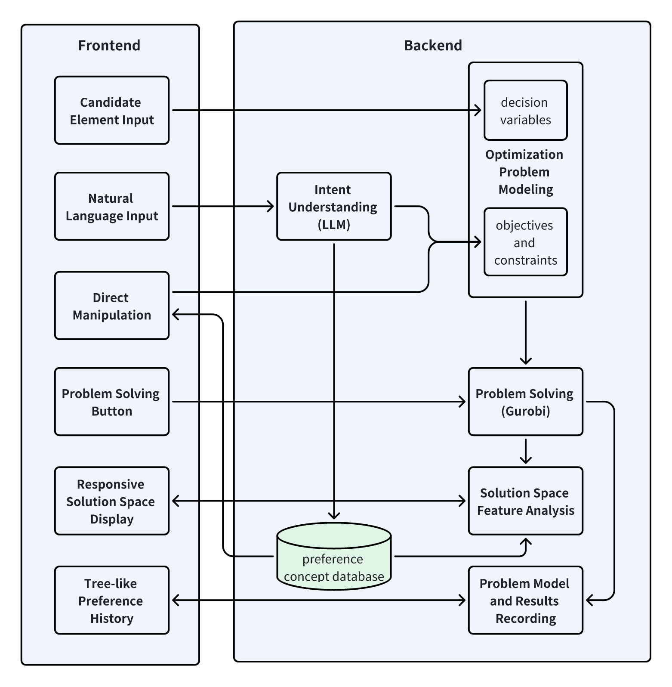

# PrefLens
PrefLens is a new interactive interface designed to help end-users effectively solve combinatorial optimization problems in real-life scenarios. It allows users to express their preferences through natural language and direct interface manipulation. The system then translates these preferences into a machine-understandable format, which is passed to a mathematical solver to compute the solution. The results are visualized on the interface, helping users refine their preference descriptions. The interaction cycle between the user and the solver-based system is as follows:
1. The user provides a set of candidate elements to form the decision space.
2. The system extracts all feasible solutions from the decision space based on the user-expressed preferences (objectives and constraints), forming the solution space.
3. The user refines their preferences based on their understanding of the solution space.

## Main Features 
Based on user interaction needs identified through a formative study, we have implemented a prototype with the following four main features:
1. Incremental Element Inclusion: Allows users to progressively add candidate elements for problem solving, matching their natural solving pace and reducing cognitive load in single-step decision-making.
2. Flexible and Intuitive Preference Expression: Supports users in expressing preferences through natural language and interface interactions.
3. Anticipatory Feasibility Explanation of Solution Space: Displays potential values of solution features and the selection status of candidate elements, reducing unnecessary trial-and-error.
4. Traceable Preference History: Facilitates multi-branching solution comparison and decision backtracking.

## System Framework
The framework diagram illustrates the architecture of the PrefLens system, which is composed of a frontend and a backend, each containing distinct components that interact with each other to enable the user to solve optimization problems.

In the frontend, users can input candidate elements, which are represented as decision variables, and express their preferences through natural language or direct manipulation. The frontend also includes features like a problem-solving button that triggers the optimization process and a responsive solution space display that presents the results. Additionally, the tree-like preference history allows users to trace their decision-making process and refine their preferences over time.

The backend consists of several key components. The "Intent Understanding" module, powered by a large language model (LLM), processes the user's natural language input, extracting objectives and constraints to construct an optimization problem model. This model is then passed to the solver (Gurobi), which computes the solution based on the provided objectives and constraints. The system also analyzes the features of the solution space and records the problem model and results. All preference concepts, which are generated during interactions, are stored in a preference concept database for future reference and refinement.

## Code Structure

